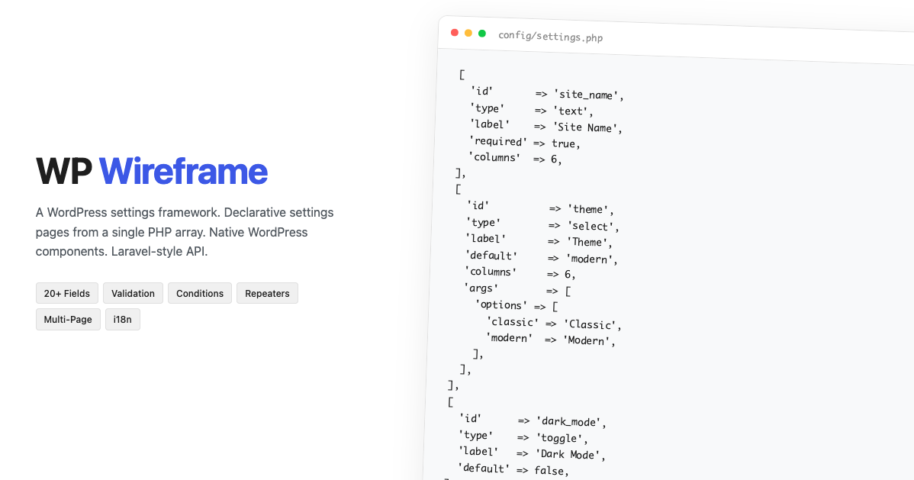

# WP Wireframe

**Skip the admin UI. Ship your plugin.**

A fast, standardised way to build WordPress settings pages. List your fields in a PHP array and WP Wireframe builds the whole admin page using WordPress React components. Same clean UI, same field behaviour, same patterns across every plugin you ship.

📖 **[Read the docs →](https://tdrayson.github.io/wp-wireframe/)**

---

## Features

- **One PHP array, full settings page** — tabs, sections, and 20+ field types
- **Standardised fields** — every input looks and behaves the same across plugins and projects
- **Native WordPress look** — built on `@wordpress/components` and `@wordpress/admin-ui`
- **Laravel-style API** — `Settings::get()`, `Settings::bool()`, dot notation
- **Validation & conditional fields** — server-side rules and show/hide logic built right into the field config
- **Role-based access** — per-field view/edit gating using role slugs or capabilities
- **Multi-page, repeaters, import/export, action buttons, i18n** — included out of the box
- **Zero JS build** — pre-built React app ships with the package

---

## Demo Settings UI


---

## Requirements

- PHP 8.1+
- WordPress 6.5+

---

## Install

WP Wireframe is a library, not a standalone plugin. Bundle a copy inside your own plugin's `vendor/` folder.

### Composer (recommended)

Add the GitHub repo to your plugin's `composer.json` — no Packagist needed:

```json
{
    "repositories": [
        { "type": "vcs", "url": "https://github.com/tdrayson/wp-wireframe" }
    ],
    "require": {
        "tdrayson/wp-wireframe": "^1.0"
    }
}
```

Then `composer install` and require the autoloader from your plugin's main file:

```php
require_once __DIR__ . '/vendor/autoload.php';
```

### Manual download

Download the [latest release zip](https://github.com/tdrayson/wp-wireframe/releases/latest), extract to `your-plugin/vendor/wp-wireframe/`, and require:

```php
require_once __DIR__ . '/vendor/wp-wireframe/vendor/autoload.php';
```

See [Installation](https://tdrayson.github.io/wp-wireframe/getting-started/installation/) for the full walkthrough.

---

## Quick Start

Three files. About fifteen lines of bootstrap.

### 1. Your plugin file

```php
<?php
/**
 * Plugin Name: My Plugin
 * Description: A plugin with settings powered by WP Wireframe.
 */

require_once __DIR__ . '/vendor/autoload.php';

add_action('init', function () {
    Wireframe\App::boot([
        'prefix'     => 'my-plugin',
        'page_title' => __('My Plugin', 'my-plugin'),
        'option_key' => 'my_plugin_settings',
        'config'     => __DIR__ . '/config/settings.php',
    ]);
});
```

### 2. `config/settings.php`

```php
<?php

return [
    'tabs' => [
        [
            'id'       => 'general',
            'title'    => __('General', 'my-plugin'),
            'sections' => [
                [
                    'id'     => 'main',
                    'title'  => __('Main Settings', 'my-plugin'),
                    'fields' => [
                        ['id' => 'site_name', 'type' => 'text', 'label' => __('Site Name', 'my-plugin')],
                        ['id' => 'contact_email', 'type' => 'email', 'label' => __('Contact Email', 'my-plugin')],
                        ['id' => 'notifications', 'type' => 'toggle', 'label' => __('Enable Notifications', 'my-plugin'), 'default' => true],
                    ],
                ],
            ],
        ],
    ],
];
```

### 3. Read settings anywhere

```php
use Wireframe\Settings;

$opt = 'my_plugin_settings';   // matches your boot's option_key

$name = Settings::get($opt, 'site_name', 'Default');
$send = Settings::bool($opt, 'notifications');
```

Activate the plugin and the settings page appears in the admin menu.

---

## Documentation

Full docs at **[tdrayson.github.io/wp-wireframe](https://tdrayson.github.io/wp-wireframe/)**:

- [Configuration](https://tdrayson.github.io/wp-wireframe/configuration/boot-options/) — boot options, multi-page, submenu pages, config structure
- [Field Types](https://tdrayson.github.io/wp-wireframe/field-types/text-family/) — every field type, args reference, examples
- [Features](https://tdrayson.github.io/wp-wireframe/features/conditional-visibility/) — conditional visibility, role-based access, validation, save/reset, action field
- [Reference](https://tdrayson.github.io/wp-wireframe/reference/settings-api/) — Settings API, REST API, hooks & filters, custom field types
- [Recipes](https://tdrayson.github.io/wp-wireframe/recipes/action-handlers/) — worked patterns for action handlers, table data sources, multi-plugin setups

---

## Example plugins

- [Field Reference](./examples/field-reference) — kitchen-sink demo of every field type
- [Newsletter Signup](./examples/newsletter-signup) — config loaded from `config/settings.php`
- [QuickChat](./examples/quickchat) — SaaS-style plugin with its entire config inline

---

## Development

To work on the package itself:

```bash
git clone https://github.com/tdrayson/wp-wireframe.git
cd wp-wireframe
composer install
npm install
npm run start    # watch mode
npm run build    # production build → src/assets/
```

To work on the docs site:

```bash
cd docs
npm install
npm run dev      # serves at http://localhost:4321
```

---

## License

GPL-2.0-or-later. See [LICENSE](./LICENSE).

---

## Credits

Built on `@wordpress/components`, `@wordpress/admin-ui`, `@wordpress/dataviews`, and [rakit/validation](https://github.com/rakit/validation).
